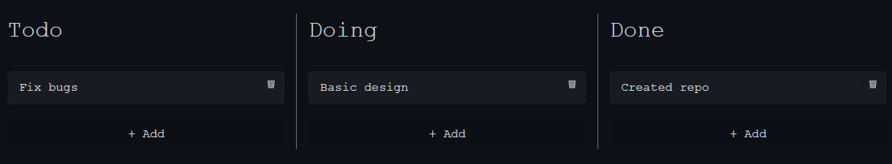

# kanban-board

A simple kanban board to be used as an add-on to markdown files within markdown files in vscode.

## About

The Kanban Board is an add-on to markdown files, allowing for a visual representation of tasks and progress directly within your repository. This project aims to integrate a Kanban-style board to enhance project management and workflow visualization. It can also be used in any website.

```html
<kanban-board class="language-kanban-board" data="{"columns":[{"id":"1","title":"Todo","items":[{"id":"19767","content":"Fix bugs"}]},{"id":"2","title":"Doing","items":[{"id":"16079","content":"Basic design"}]},{"id":"3","title":"Done","items":[{"id":"25152","content":"Created repo"}]}]}"></kanban-board>
```



## Features

- **Drag-and-Drop Interface**: Easily move tasks between different stages of your workflow.
- **Customizable Columns**: Tailor the board to fit your project's specific needs with customizable columns.
- **Lit**: It is powered by [Lit](https://www.npmjs.com/package/lit), a simple and fast library for building lightweight web components.

## Getting Started

To get started with the Kanban Board, clone this repository and follow the setup instructions below.

### Prerequisites

- Node.js
- npm

### Installation

1. Clone the repository:

   ```bash
   git clone https://github.com/phfsantos/kanban-board.git
   ```
2. Navigate to the project directory:

   ```bash
   cd kanban-board
   ```
3. Install the dependencies:

   ```bash
   npm install
   ```

### Usage

To launch the Kanban Board, run the following command:

```bash
npm start
```

This will open the board in your default web browser.

## Contributing

Contributions are what make the open-source community such an amazing place to learn, inspire, and create. Any contributions you make are **greatly appreciated**.

If you have a suggestion that would make this better, please fork the repo and create a pull request. You can also simply open an issue with the tag “enhancement”.

Don’t forget to give the project a star! Thanks again!

## License

Distributed under the MIT License. See `LICENSE` for more information.

## Contact

Pedro Santos - [@ordepim](https://twitter.com/ordepim) - phfsantos@hotmail.com - Project Link: [https://github.com/phfsantos/kanban-board](https://github.com/phfsantos/kanban-board)

## Acknowledgments

- Domenic (dcode) - [@dcodeyt](https://twitter.com/dcodeyt) - Project Link: [https://github.com/dcode-youtube/kanban-board](https://github.com/dcode-youtube/kanban-board)

```

Please make sure to update the placeholders (like `Your Name`, `@your_twitter`, and `email@example.com`) with your actual information. Also, feel free to adjust the sections according to the specifics of the `kanban-board` project. Enjoy managing your projects with the new Kanban Board!
```
