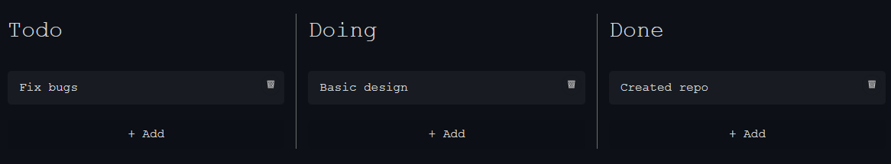

# kanban-board

A simple kanban board to be used as an add-on to markdown files within markdown files in vscode.

## About

The Kanban Board is an add-on to markdown files, allowing for a visual representation of tasks and progress directly within your repository. This project aims to integrate a Kanban-style board to enhance project management and workflow visualization. It can also be used in any website.

```html
<kanban-board id="board"></kanban-board>
<script type="module">
  import '@phfsantos/kanban-board';
  
  const board = document.getElementById('board');
  board.setData({
    columns: [
      { id: "1", title: "Todo", items: [{ id: "1", content: "Fix bugs" }] },
      { id: "2", title: "Doing", items: [{ id: "2", content: "Basic design" }] },
      { id: "3", title: "Done", items: [{ id: "3", content: "Created repo" }] }
    ]
  });
</script>
```



## Features

- **Drag-and-Drop Interface**: Easily move tasks between different stages of your workflow.
- **Customizable Columns**: Tailor the board to fit your project's specific needs with customizable columns.
- **Comprehensive Error Handling**: Built-in validation and user-friendly error messages with event-based error reporting.
- **Keyboard Navigation**: Full accessibility support with keyboard controls for moving items between columns.
- **Data Validation**: Automatic validation with Zod to ensure data integrity.
- **Event-Driven Architecture**: Listen to data changes for automatic persistence.
- **TypeScript Support**: Full type safety with TypeScript definitions included.
- **Lit**: It is powered by [Lit](https://www.npmjs.com/package/lit), a simple and fast library for building lightweight web components.

## Getting Started

### Installation via npm

Install the package in your project:

```bash
npm install @phfsantos/kanban-board
```

Or with yarn:

```bash
yarn add @phfsantos/kanban-board
```

### Usage in Your Project

Import and use the kanban-board web component in your application:

```javascript
import '@phfsantos/kanban-board';
```

Then use it in your HTML with the new API:

```html
<kanban-board id="board"></kanban-board>

<script type="module">
  const board = document.getElementById('board');
  
  // Set initial data
  board.setData({
    columns: [
      { 
        id: "1", 
        title: "Todo", 
        items: [
          { id: "1", content: "Fix bugs" }
        ] 
      },
      { id: "2", title: "Doing", items: [] },
      { id: "3", title: "Done", items: [] }
    ]
  });
  
  // Listen for data changes to persist them
  board.addEventListener('kanban-change', (e) => {
    // Save to localStorage, backend API, etc.
    localStorage.setItem('kanban-data', JSON.stringify(e.detail.data));
  });
</script>
```

> **Note:** The old `data` attribute is deprecated. See [MIGRATION-GUIDE-v1.3.md](MIGRATION-GUIDE-v1.3.md) for details.

## API Reference

### Methods

#### `setData(data, dispatchEvent = true): boolean`

Set the kanban board data with automatic validation.

**Parameters:**
- `data` (KanbanBoardData): The board data to set
- `dispatchEvent` (boolean, optional): Whether to dispatch a `kanban-change` event (default: `true`)

**Returns:** `boolean` - `true` if data was set successfully, `false` if validation failed

**Example:**
```javascript
const success = board.setData({
  columns: [
    { id: "1", title: "Todo", items: [] }
  ]
});

if (!success) {
  console.error('Invalid data provided');
}
```

#### `getData(): KanbanBoardData`

Get a copy of the current board data.

**Returns:** `KanbanBoardData` - A deep copy of the current board state

**Example:**
```javascript
const currentData = board.getData();
console.log(currentData);

// Save to backend
fetch('/api/kanban', {
  method: 'POST',
  body: JSON.stringify(currentData)
});
```

### Events

#### `kanban-change`

Dispatched whenever the board data changes (items moved, added, deleted, or updated).

**Event Detail:**
```typescript
{
  data: KanbanBoardData,  // Current board data
  timestamp: number        // Unix timestamp in milliseconds
}
```

**Example:**
```javascript
board.addEventListener('kanban-change', (e) => {
  console.log('Data changed at:', new Date(e.detail.timestamp));
  localStorage.setItem('kanban-data', JSON.stringify(e.detail.data));
});
```

#### `kanban-error`

Dispatched when an error occurs in the board.

**Event Detail:**
```typescript
{
  type: 'validation' | 'operation' | 'system',
  message: string,          // Technical error message
  userMessage?: string,     // User-friendly message
  details?: any            // Additional error details
}
```

**Example:**
```javascript
board.addEventListener('kanban-error', (e) => {
  const error = e.detail;
  
  // Show user-friendly message
  alert(error.userMessage || error.message);
  
  // Log technical details
  console.error('Kanban error:', error);
});
```

### Data Types

The `data` structure follows this TypeScript interface:

```typescript
type KanbanBoardData = {
  columns?: Array<{
    id: string;
    title: string;
    items: Array<{
      id: string;
      content: string;
    }>;
  }>;
}
```

### Validation Schemas

The component uses Zod for runtime validation. You can import and use these schemas:

```typescript
import { 
  KanbanBoardDataSchema,
  KanbanColumnSchema,
  KanbanItemSchema 
} from '@phfsantos/kanban-board';

// Validate data before setting
try {
  const validated = KanbanBoardDataSchema.parse(myData);
  board.setData(validated);
} catch (error) {
  console.error('Validation failed:', error);
}
```

### Error Handling

The kanban-board component includes comprehensive error handling with user-friendly error messages and event-based error reporting.

#### Listening to Error Events

You can listen to the `kanban-error` event to handle errors in your application:

```javascript
const board = document.querySelector('kanban-board');

board.addEventListener('kanban-error', (event) => {
  const error = event.detail;
  
  // Display user-friendly message
  console.error('User Message:', error.userMessage);
  
  // Log technical details for debugging
  console.error('Technical Details:', error.message, error.details);
  
  // Show notification to user
  showNotification(error.userMessage || error.message);
});
```

#### Error Event Structure

```typescript
type KanbanError = {
  type: 'validation' | 'operation' | 'system';
  message: string;          // Technical error message
  userMessage?: string;     // User-friendly message
  details?: any;            // Additional error details
};
```

#### Error Types

- **validation**: Invalid input data (e.g., invalid column ID, invalid item data)
- **operation**: Failed operation (e.g., failed to move item, failed to update)
- **system**: System-level errors (e.g., data corruption)

#### Available Error Messages

- `COLUMN_NOT_FOUND`: The column you are trying to update does not exist
- `ITEM_NOT_FOUND`: The item you are trying to update does not exist
- `INVALID_DATA`: The data provided is invalid
- `NO_COLUMNS`: No columns are available
- `MOVE_FAILED`: Failed to move the item
- `UPDATE_FAILED`: Failed to update the item
- `ADD_FAILED`: Failed to add the item

For a complete demonstration of error handling, see [test-error-handling.html](test-error-handling.html).

## Customization

The kanban-board component exposes **24 named parts** for complete customization using CSS `::part()` selectors. This allows you to style every aspect of the board without breaking shadow DOM encapsulation.

### All Available Parts (24)

#### Main Container
- `::part(kanban-container)` - The main kanban board container

#### Columns (4 parts)
- `::part(column)` - Individual column component
- `::part(column-title)` - Column title (editable)
- `::part(column-items)` - Container for items in a column
- `::part(column-add-button)` - "Add" button at bottom of column

#### Items (9 parts)
- `::part(item)` - Individual item component
- `::part(item-container)` - Outer container for an item
- `::part(item-content)` - Item content area (editable)
- `::part(item-actions)` - Container for item action buttons
- `::part(item-action-up)` - Move item up button (↑)
- `::part(item-action-down)` - Move item down button (↓)
- `::part(item-action-left)` - Move item left button (←)
- `::part(item-action-right)` - Move item right button (→)
- `::part(item-action-delete)` - Delete item button (❌)

#### Drop Zones (3 parts)
- `::part(dropzone)` - Drop zone component
- `::part(dropzone-area)` - Outer drop zone area
- `::part(dropzone-content)` - Inner drop zone visual indicator

#### Dialog (7 parts)
- `::part(dialog)` - Delete confirmation dialog
- `::part(dialog-form)` - Form wrapper inside dialog
- `::part(dialog-title)` - Dialog title
- `::part(dialog-description)` - Description text
- `::part(dialog-buttons)` - Container for dialog buttons
- `::part(dialog-cancel-button)` - Cancel button
- `::part(dialog-confirm-button)` - Confirm/delete button

### Quick Start Examples

#### Basic Styling

```css
/* Style the main container */
kanban-board::part(kanban-container) {
  background: #f5f5f5;
  padding: 40px;
  border-radius: 8px;
}

/* Style all columns */
kanban-board::part(column) {
  background: white;
  border-radius: 8px;
  box-shadow: 0 2px 4px rgba(0, 0, 0, 0.1);
}

/* Style items */
kanban-board::part(item-container) {
  background: white;
  border: 1px solid #e0e0e0;
  transition: transform 0.2s;
}

kanban-board::part(item-container):hover {
  transform: translateY(-2px);
  box-shadow: 0 4px 8px rgba(0, 0, 0, 0.15);
}
```

#### Dark Theme Example

```css
kanban-board::part(kanban-container) {
  background: #1a1a1a;
}

kanban-board::part(column) {
  background: #2d2d2d;
  border: 1px solid #404040;
}

kanban-board::part(column-title) {
  color: #e0e0e0;
}

kanban-board::part(item-container) {
  background: #3a3a3a;
  border: 1px solid #4a4a4a;
}

kanban-board::part(item-content) {
  color: #e0e0e0;
}
```

#### Item Actions Styling

```css
/* Style action buttons */
kanban-board::part(item-action-up),
kanban-board::part(item-action-down),
kanban-board::part(item-action-left),
kanban-board::part(item-action-right) {
  background: #3498db;
  color: white;
  border: none;
  border-radius: 3px;
  padding: 4px 8px;
}

kanban-board::part(item-action-delete) {
  background: #e74c3c;
  color: white;
}
```

### Complete Documentation

For comprehensive documentation, theme examples, and advanced techniques:

- 📖 [Complete Part Selectors Reference](./docs/PART-SELECTORS.md) - All 24 parts with detailed examples
- 🎨 [Interactive Demo](./examples/complete-parts-demo.html) - Live demo with 5 preset themes
- 🔔 [Dialog Customization Guide](./docs/DIALOG-CUSTOMIZATION.md) - Detailed dialog styling guide

### Browser Support

CSS `::part()` is supported in:
- Chrome/Edge: 73+
- Firefox: 72+
- Safari: 13.1+
- Opera: 60+

kanban-board::part(dialog-confirm-button):hover {
  background: #dc2626;
}
```

#### Example: Dark Theme Integration

```css
/* Light theme */
kanban-board::part(dialog) {
  background: white;
  color: #1f2937;
  border: 1px solid #e5e7eb;
}

/* Dark theme */
.dark-mode kanban-board::part(dialog) {
  background: #1f2937;
  color: #f3f4f6;
  border: 1px solid #374151;
}

.dark-mode kanban-board::part(dialog-title) {
  color: #f9fafb;
}

.dark-mode kanban-board::part(dialog-confirm-button) {
  background: #ef4444;
  color: white;
}
```

For a complete demonstration, see [examples/custom-dialog-styling.html](examples/custom-dialog-styling.html).

For detailed documentation on dialog customization, see [DIALOG-CUSTOMIZATION.md](docs/DIALOG-CUSTOMIZATION.md).

### Development Setup

To contribute or run the project locally:

#### Prerequisites

- Node.js >= 16.0.0
- npm

#### Installation

1. Clone the repository:

   ```bash
   git clone https://github.com/phfsantos/kanban-board.git
   ```
2. Navigate to the project directory:

   ```bash
   cd kanban-board
   ```
3. Install the dependencies:

   ```bash
   npm install
   ```

#### Development

To launch the development server:

```bash
npm start
```

This will open the board in your default web browser with hot reload.

To build the project:

```bash
npm run build
```

## Contributing

Contributions are what make the open-source community such an amazing place to learn, inspire, and create. Any contributions you make are **greatly appreciated**.

If you have a suggestion that would make this better, please fork the repo and create a pull request. You can also simply open an issue with the tag “enhancement”.

Don’t forget to give the project a star! Thanks again!

## License

Distributed under the MIT License. See `LICENSE` for more information.

## Contact

Pedro Santos - [@ordepim](https://twitter.com/ordepim) - phfsantos@hotmail.com - Project Link: [https://github.com/phfsantos/kanban-board](https://github.com/phfsantos/kanban-board)

## Acknowledgments

- Domenic (dcode) - [@dcodeyt](https://twitter.com/dcodeyt) - Project Link: [https://github.com/dcode-youtube/kanban-board](https://github.com/dcode-youtube/kanban-board)

```

Please make sure to update the placeholders (like `Your Name`, `@your_twitter`, and `email@example.com`) with your actual information. Also, feel free to adjust the sections according to the specifics of the `kanban-board` project. Enjoy managing your projects with the new Kanban Board!
```
